# iot-socket-2026
IoT 개발자 소켓 리포지토리

- [가상머신]VMware Workstation Pro 설치 방법
- https://all4null.tistory.com/75

- Ubuntu Desktop 버전 (24.04.4 LTS)설치
- https://ubuntu.com/download/desktop/thank-you?version=24.04.4&architecture=amd64&lts=true
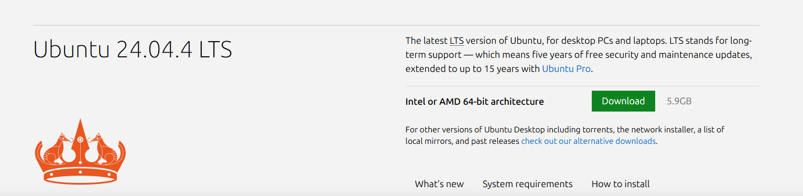

- 외워햐 할 함수
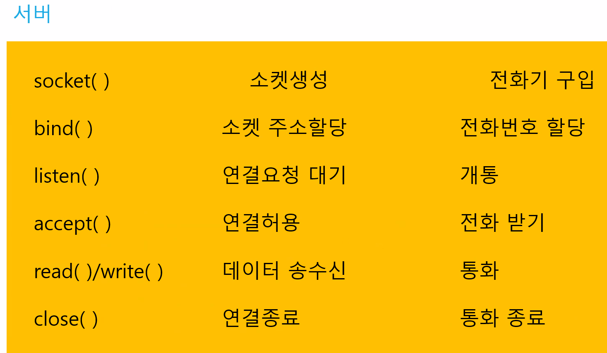

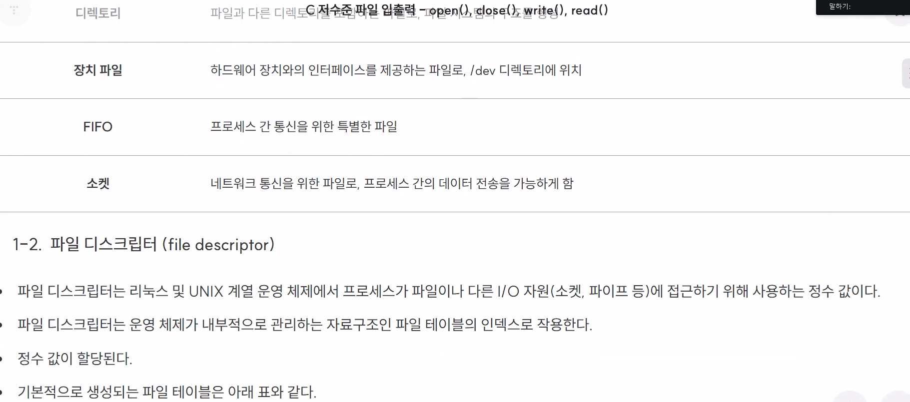

- 리눅스 명령어
pwd:현재위치
~: 사용자 디렉토리
/:root 디렉토리
cd: 디렉토리 이동 ex) cd work(이동할려는 디렉토리) 
ls: 디렉토리 확인 
    옵셔: -a(숨겨진 파일), -l(자세히),
clear:화면 지우기
ip a:ip확인
mkdir:새로운 디렉토리를 만든다.
.: 현재 디렉토리
..: 상위 디렉토리
rm -fr : 삭제 명령(폴더와 안에 내용도 삭제)
mkdir: 새로운 디렉토리를 만든다.

sudo apt install terminator
pwd
mkdir socket
cd socket
sl
ls
sudo nano /etc/nanorc
sudo nano /etc/nanorc
nano hello.cp
```
#include <stdio.h>

void main() {
    printf("Hello world!!\n");
}
```
gcc -version
ls
gcc hello.c
ls
a.out
./a.out
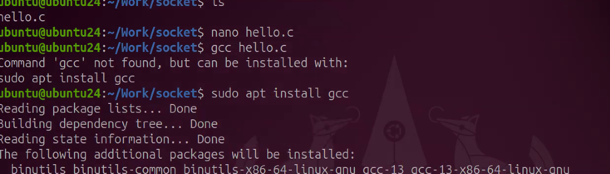
라인 넘버
탭 사이즈g
ls
ls -l
total 20
ls -al
total 28

## 1일차
ubuntu

sudo apt update

나중에 비번 입력할때는 비번이 안보임

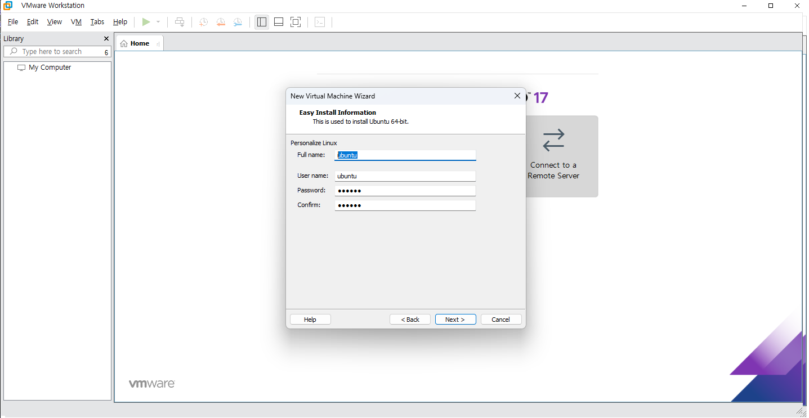

- 기본 설정(1)
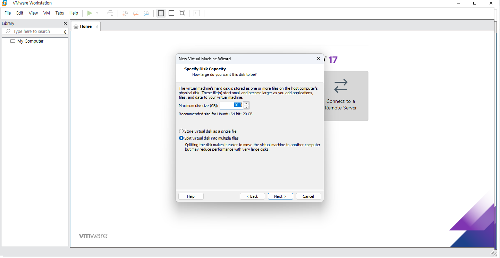

- 기본 설정(2)
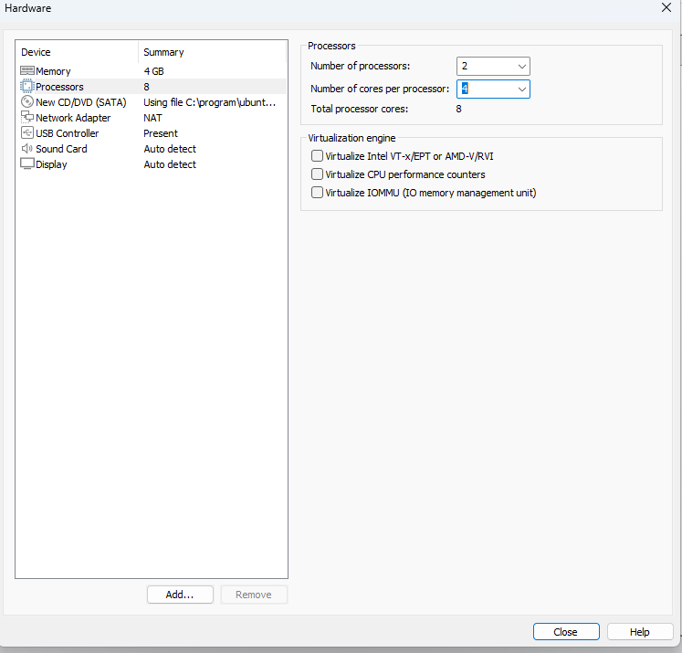

- 기본 설정(3)
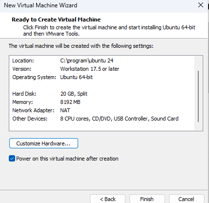

- 기본 설정(4)
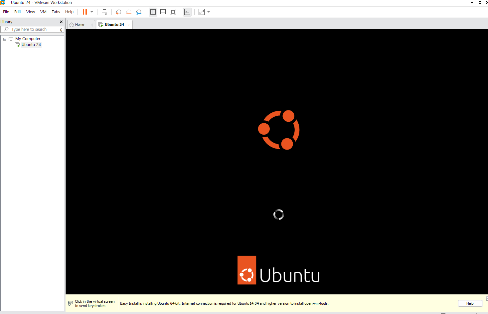

아이디 ubuntu
닉네임 ubuntu24 

리눅스를 소켓으로 처리한다.

## 2일차

```
sudo systemctl start ssh
systemctl status ssh

ip addr 

되면 cmd로 들어가서

ssh ubuntu를 입력한다
yes를 누르면 사진과 같이 ip주소를 확인 가능하다.

```

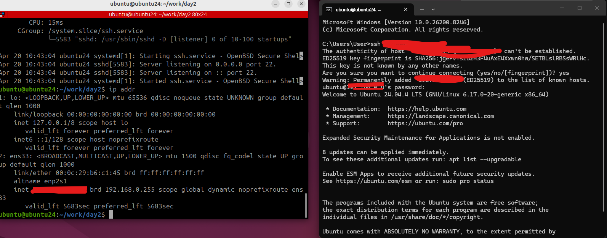


- 1. 파일 디스크립터 (번호표)

- 핵심: 리눅스는 소켓도 파일처럼 관리한다.
- 교훈: socket()을 실행하면 컴퓨터가 3번 같은 숫자(FD)를 주는데, 앞으로 이 번호를 통해 데이터를 주고받는다

2. 엔디안 변환 (숫자 방향 바꾸기)
- 함수: htons, htonl
- 핵심: 내 컴퓨터와 네트워크의 숫자 읽는 방향이 다를 수 있다.
- 교훈: 보내기 전엔 반드시 네트워크 방향(Big-Endian)으로 숫자를 뒤집어줘야 한다.

3. 주소 변환: inet_addr vs inet_aton (가장 최근 내용!)
- IP 주소 문자열("192.168...")을 컴퓨터용 숫자로 바꾸는 두 가지 방법을 배우셨어요.
- (inet_addr): 주소를 숫자로 바꿔서 결과값만 툭 던져주는 방식. (사용은 쉽지만 에러 처리가 까다로움)
- (inet_aton): 주소를 숫자로 바꿔서 구조체(가방) 안에 바로 넣어주는 방식.
    - 성공하면 1, 실패하면 0을 줘서 에러 체크하기가 훨씬 좋아요.
    - 이미지 하단 주석처럼 "성공 시 1, 실패 시 0"이라는 특징을 이용해 if문으로 안전하게 코드를 짜는 법을 배우신 겁니다.

4. 구조체 (sockaddr_in) 맛보기
- struct sockaddr_in addr_inet;은 네트워크 정보를 담는 전용 가방이에요.
- 이 가방 안에는 IP 주소, 포트 번호, 통신 방식을 다 담을 수 있습니다. 지금은 그중 IP 주소를 넣는 법(sin_addr)을 연습하신 거예요.

- 전화기(소켓) 번호표를 받고, 상대방 전화번호(IP)를 통신 규격에 맞게 변환해서 가방(구조체)에 잘 담는 과정

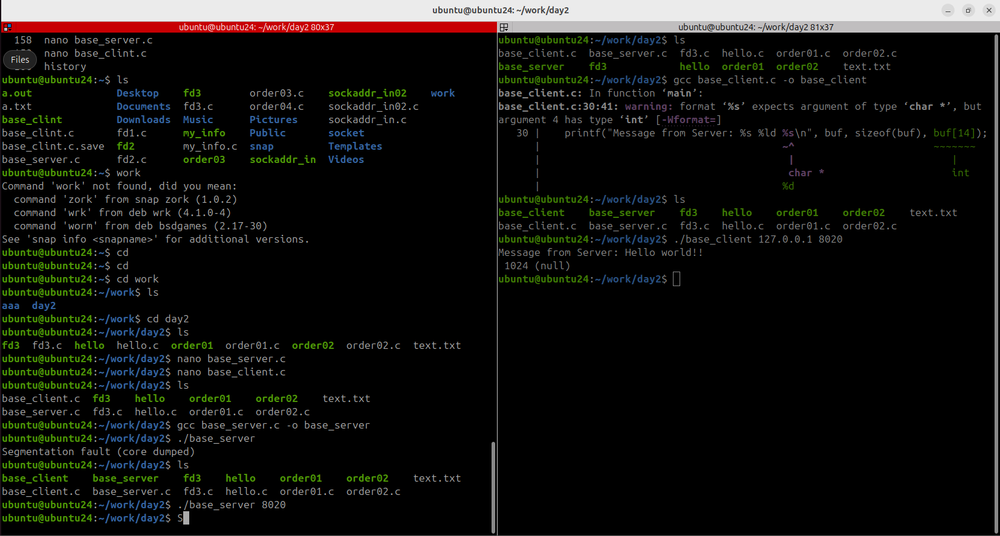