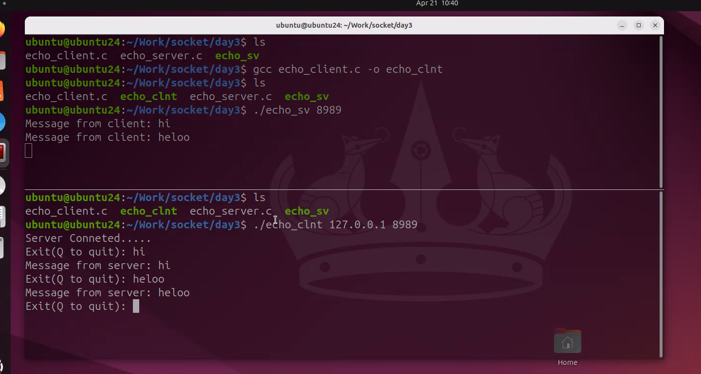
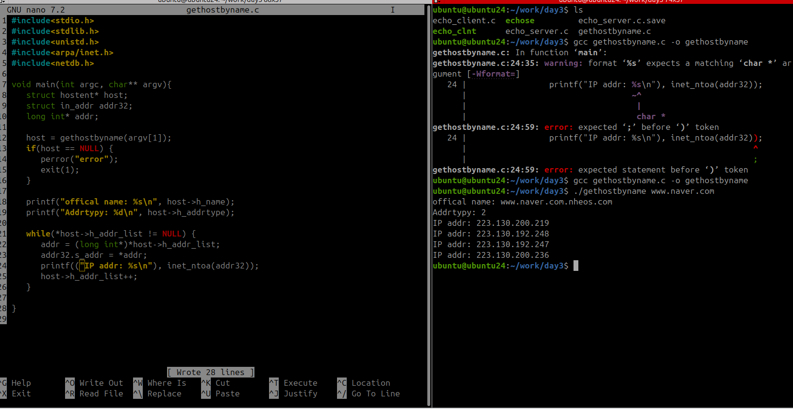
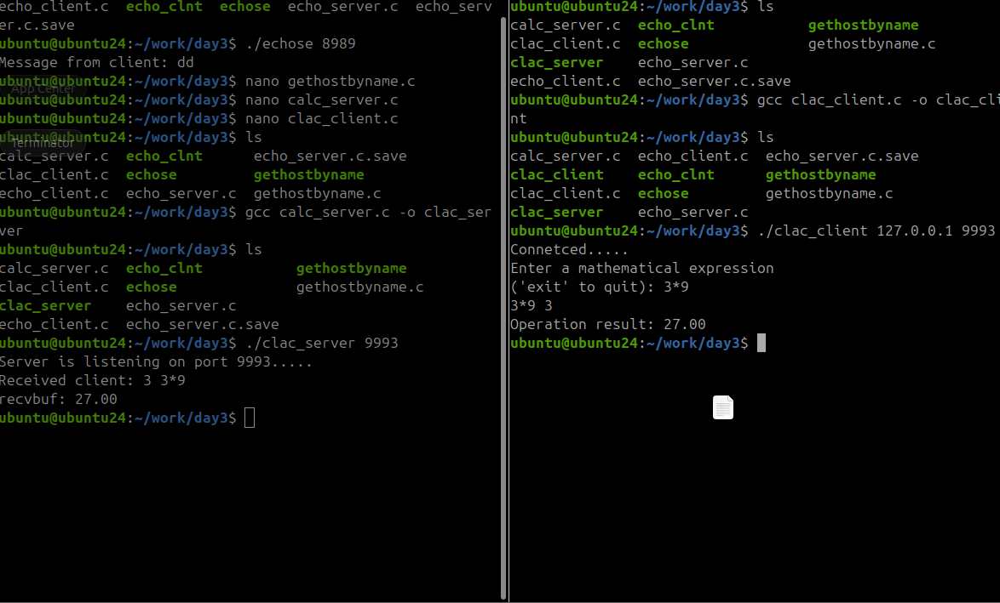
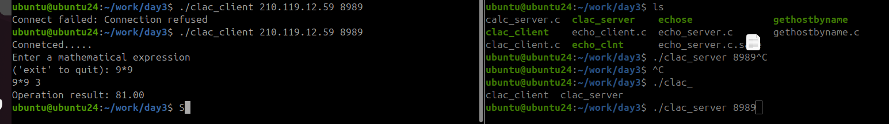

# iot-socket-2026
IoT 개발자 소켓 리포지토리

- [가상머신]VMware Workstation Pro 설치 방법
- https://all4null.tistory.com/75

- Ubuntu Desktop 버전 (24.04.4 LTS)설치
- https://ubuntu.com/download/desktop/thank-you?version=24.04.4&architecture=amd64&lts=true


- 외워햐 할 함수


- 리눅스 명령어
pwd:현재위치
~: 사용자 디렉토리
/:root 디렉토리
cd: 디렉토리 이동 ex) cd work(이동할려는 디렉토리) 
ls: 디렉토리 확인 
    옵셔: -a(숨겨진 파일), -l(자세히),
clear:화면 지우기
ip a:ip확인
mkdir:새로운 디렉토리를 만든다.
.: 현재 디렉토리
..: 상위 디렉토리
rm -fr : 삭제 명령(폴더와 안에 내용도 삭제)
mkdir: 새로운 디렉토리를 만든다.

sudo apt install terminator
pwd
mkdir socket
cd socket
sl
ls
sudo nano /etc/nanorc
sudo nano /etc/nanorc
nano hello.cp
```
#include <stdio.h>

void main() {
    printf("Hello world!!\n");
}
```
gcc -version
ls
gcc hello.c
ls
a.out
./a.out

라인 넘버
탭 사이즈g
ls
ls -l
total 20
ls -al
total 28

## 1일차
ubuntu

sudo apt update

나중에 비번 입력할때는 비번이 안보임


- 기본 설정(1)


- 기본 설정(2)


- 기본 설정(3)


- 기본 설정(4)


아이디 ubuntu
닉네임 ubuntu24 

리눅스를 소켓으로 처리한다.

## 2일차

```
sudo systemctl start ssh
systemctl status ssh

ip addr 

되면 cmd로 들어가서

ssh ubuntu를 입력한다
yes를 누르면 사진과 같이 ip주소를 확인 가능하다.

```


- 1. 파일 디스크립터 (번호표)

- 핵심: 리눅스는 소켓도 파일처럼 관리한다.
- 교훈: socket()을 실행하면 컴퓨터가 3번 같은 숫자(FD)를 주는데, 앞으로 이 번호를 통해 데이터를 주고받는다

2. 엔디안 변환 (숫자 방향 바꾸기)
- 함수: htons, htonl
- 핵심: 내 컴퓨터와 네트워크의 숫자 읽는 방향이 다를 수 있다.
- 교훈: 보내기 전엔 반드시 네트워크 방향(Big-Endian)으로 숫자를 뒤집어줘야 한다.

3. 주소 변환: inet_addr vs inet_aton (가장 최근 내용!)
- IP 주소 문자열("192.168...")을 컴퓨터용 숫자로 바꾸는 두 가지 방법을 배우셨어요.
- (inet_addr): 주소를 숫자로 바꿔서 결과값만 툭 던져주는 방식. (사용은 쉽지만 에러 처리가 까다로움)
- (inet_aton): 주소를 숫자로 바꿔서 구조체(가방) 안에 바로 넣어주는 방식.
    - 성공하면 1, 실패하면 0을 줘서 에러 체크하기가 훨씬 좋아요.
    - 이미지 하단 주석처럼 "성공 시 1, 실패 시 0"이라는 특징을 이용해 if문으로 안전하게 코드를 짜는 법을 배우신 겁니다.

4. 구조체 (sockaddr_in) 맛보기
- struct sockaddr_in addr_inet;은 네트워크 정보를 담는 전용 가방이에요.
- 이 가방 안에는 IP 주소, 포트 번호, 통신 방식을 다 담을 수 있습니다. 지금은 그중 IP 주소를 넣는 법(sin_addr)을 연습하신 거예요.

- 전화기(소켓) 번호표를 받고, 상대방 전화번호(IP)를 통신 규격에 맞게 변환해서 가방(구조체)에 잘 담는 과정




## 3일차

- puppy 다운

- https://www.chiark.greenend.org.uk/~sgtatham/putty/latest.html


- 1. 서버(Server): 대화를 기다리는 "가게 주인"
서버 코드에서 가장 중요한 흐름은 이 4가지입니다.
- socket(): 전화기를 산다.
- bind(): 가게 전화번호(IP, Port)를 등록한다.
- listen(): 손님(클라이언트)의 전화가 오기를 기다린다.
- accept(): 벨이 울리면 전화를 받는다. (이때 실제 대화를 나눌 **client_fd**가 새로 생겨요!)
recv & send: 손님이 한 말을 듣고(recv), 똑같이 대답한다(send).
- 2. 클라이언트(Client): 전화를 거는 "손님"
클라이언트는 서버보다 훨씬 단순합니다.
- socket(): 내 휴대폰을 준비한다.
- connect(): 가게 주소와 전화번호를 누르고 연결이 될 때까지 기다린다.
- send & recv: 내가 먼저 말을 걸고(send), 주인의 대답을 듣는다(recv).

- 서버를 먼저 작동하고 클라이언트가 작동

    


server 서버 받아서 계산기 하는거임
    

- ip 공유기 해서 하는법
    

### 4일차

- 멀티 프로세스
    - 장점: 안정성, 보안
    - 단점: 자원 소모, 통신 복잡
- 멀티 스레드
    - 장점: 효율성, 자원 절약
    - 단점: 위험성, 동기화 문제

- 📊 멀티 프로세스 vs 멀티 스레드 차이점

| 구분 | 멀티 프로세스 (Multi-process) | 멀티 스레드 (Multi-thread) |
|:---:|:---|:---|
| **자원 공유** | 독립적인 메모리 구조 (공유 안 함) | 프로세스 내 자원 공유 (Code, Data, Heap) |
| **통신 방식** | IPC (Pipe, Socket 등) 필요 (복잡함) | 공유 메모리를 통한 직접 통신 (빠름) |
| **생성 비용** | 높음 (새 프로세스 생성이 무거움) | 낮음 (스레드 생성이 가볍고 빠름) |
| **안정성** | 높음 (하나가 죽어도 나머지는 멀쩡) | 낮음 (하나의 스레드 오류가 전체 영향) |
| **동기화** | 필요 없음 (서로 남남) | 필수 (데이터 충돌 방지 필요) |
| **Context Switching** | 느림 (매번 메모리 맵을 바꿔야 함) | 빠름 (스택 영역만 바꾸면 됨) |


- 리눅스 업데이트 
    1.puppy를 켜서 ip를 입력한뒤 로그인한다
    ```
    sudo apt update (패키지 목록 업데이트)
    sudo apt upgrade (패키지 업데이트)
    ps ( 현재 터미널로 프로세스 확인한다.)
    ps au (전체 프로세스 상태 확인)
    ```

- 파트 1: 프로세스 생성 및 소멸 관리
    1. fork.c (프로세스 생성의 이해)
        - 핵심 개념: fork() 함수 호출 시 부모 프로세스를 복사하여 새로운 자식 프로세스를 생성합니다.
    2. zombie.c (좀비 프로세스의 발생)
        - 핵심 개념: 자식 프로세스가 종료되었음에도 불구하고, 부모가 그 종료 상태를 받아주지 않아 시스템에 남아있는 상태입니다.
    3. wait.c (자식의 종료 대기)
        - 핵심 개념: wait() 함수를 사용하여 부모가 자식의 종료를 기다리고, 좀비 프로세스를 방지합니다.
    4. waitpid.c (Non-blocking 대기 방식)
        - 핵심 개념: wait()의 블로킹 문제를 해결하기 위해 waitpid와 WNOHANG 옵션을 사용합니다.
- 파트 2: 멀티 프로세스 기반 서버 및 시그널 핸들링
    1. sigaction.c (시그널 제어)
        - 핵심 개념: 특정 이벤트(타이머, 자식 종료 등) 발생 시 운영체제가 프로세스에 알림을 주는 시그널을 제어합니다.
    2. echo_mpserver.c (멀티 프로세스 서버)
        - 핵심 개념: fork()를 이용해 다중 클라이언트 접속을 동시에 처리하는 서버를 구현합니다.
    3. echo_mpclient.c (멀티 프로세스 클라이언트)
        - 핵심 개념: 클라이언트의 데이터 송신과 수신 루틴을 분리하여 동시에 처리합니다.
    4. echo_storeserv.c (IPC - 파이프를 이용한 데이터 저장)
        - 핵심 개념: 프로세스 간 통신(IPC) 수단인 **Pipe(파이프)**를 사용하여 메시지를 별도 파일에 기록합니다.
- 파트 3: 프로세스 간 통신(IPC) 및 멀티 스레드 입문
    1. pipe01.c & pipe02.c (양방향 통신의 이해)
        - 핵심 개념: 단방향 통신 도구인 Pipe를 사용하여 부모와 자식 프로세스가 데이터를 주고받는 방법을 실습합니다.
    2. thread01.c (멀티 스레드 기초)
        - 핵심 개념: 프로세스보다 가벼운 실행 단위인 **스레드(Thread)**를 생성하고 실행합니다.
    3. thread02.c (스레드의 종료 대기 및 반환값 처리)
        - 핵심 개념: 스레드가 종료될 때까지 기다리고 결과 데이터를 메인 프로세스로 전달받습니다.
    
    - 내용 요약
    1. 프로세스 관리: fork로 자식을 만들고 wait, waitpid를 통해 좀비 프로세스를 방지하는 법을 익힘.

    2. 네트워크 응용: 멀티 프로세스를 활용해 여러 클라이언트를 동시에 처리하는 에코 서버/클라이언트를 구현함.

    3. 시그널 및 통신: sigaction으로 시스템 이벤트를 제어하고, pipe를 통해 프로세스끼리 대화하거나 데이터를 저장하는 IPC 기법을 학습함.
    
    4. 스레드 전환: 프로세스보다 효율적인 pthread 기술을 사용하여 자원을 공유하며 병렬 처리를 수행하는 멀티 스레드 프로그래밍의 기초를 다짐.